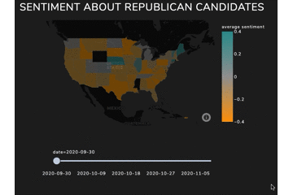

# Tweet the People

Tracks Twitter sentiment about the 2020 US presidential election.

**See it in action here: http://laraehr.pythonanywhere.com/**

The GitHub repo for the front-end is here: https://github.com/lara-ehr/tweet-the-people-vizweb

## Aims

In 2020, like in 2016, polling drastically misestimated the electoral performance of the US presidential election candidates. The aim of this project is to put an ear to the ground, using Twitter data and sentiment analysis to understand what issues potential voters are talking about, how they feel about them and how that differs based on users' location in the US.

## Demo

## Approach and Features

Built using Docker, MongoDB, Postgres, tweepy, VADER, geocoder, SQLAlchemy, pymongo. Twitter data were streamed from 28 September 2020 (the day before the first presidential candidate debate between Joe Biden and Donald Trump) to 8 November 2020 (the day after Joe Biden was projected as the election winner by the AP). 

- **Data collection using a Docker architecture:** There are 4 Docker containers: one runs the tweet collection script (tweet_collect), one runs the ETL (etl), one hosts a MongoDB database for collecting tweets (tweet_mongodb), and one hosts a Postgres database for the transformed tweets (tweet_postgres).
- **Taming the firehose:** My sampling approach streams tweets about one of 4 candidates for roughly a minute each, then waits for ca. 5 minutes before switching politicians and starting again. This avoids the problem of the "Twitter firehose:" streaming tweets that contain 4 politicians' names generates a huge quantity of tweets, quickly running into the Twitter API's rate limitations. Streaming times are jittered to help avoid getting shut down by the Twitter API. And stream times for Mike Pence are longer than for other candidates because Twitter doesn't seem to have a whole lot to say about him (this was an attempt to avoid a class imbalance).
- **80-20 approach to data collection:** I had the option of streaming *all* of the tweets. While it's nice to have a complete historical record, this would have created issues for storage and later analysis, without providing clear benefits in terms of a finer-grained analysis. So I limited streaming to roughly one minute at a time (resulting in about 5 minutes' worth of data per politician per 2 hours; this amounted to about 10k tweets/day) and excluded tweets that didn't have any text. 20% of the data engineering, 80% of the NLP insights. :wink:
- **VADER sentiment analysis:** I wanted results quickly, and I wanted them to be interpretable. So I used the [VADER sentiment analysis tool](https://github.com/cjhutto/vaderSentiment), which takes a lexical approach to sentiment analysis. There's some obvious limitations to this approach -- one is that the word "positive" has a positive score, which of course is not necessarily the underlying sentiment in a tweet about Donald Trump testing positive for coronavirus. This is something I'll work on in future iterations of this project.
- **Location detection:** The map is a central part of the user story for this project. Twitter allows users to geotag their posts, but few people do this, so only 1-2% of tweets are geotagged. I decided to use the location from user profiles. Yes, some people did list their location as "God Bless America" or "hell since 2016" or "nunya" (short for *none of your business*), and that introduces some noise in the data (turns out Nunya is a town in Peru). But for the most part, people's self-reported location is at least plausible, and as there is no incentive to lie, we can assume that this information is true overall. (A version of this assumption underlies massive survey efforts like the US Census.)

## Future work

- More sophisticated sentiment analysis using neural networks
- Detecting far right content in tweets

## How to use

- Make sure you have Docker, Postgres and MongoDB installed.
- Download tweet-the-people.
- Get a Twitter developer account if you don't already have one (https://developer.twitter.com/en/apply-for-access). Adapt the `credentials.py` file with your credentials.
- If you're using non-default ports, adapt docker-compose.yml and the Dockerfiles in each directory accordingly. Also adapt the `credentials.py` scripts.
- In your command line interface, navigate to the tweet-the-people directory.
  - Build the containers by typing `docker-compose build`. 
  - Get the containers running by typing `docker-compose up`.
